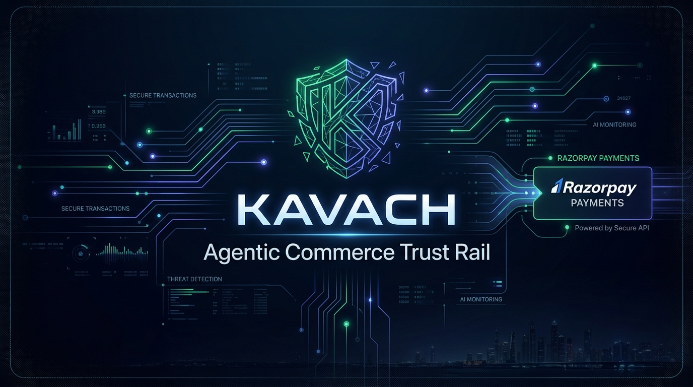
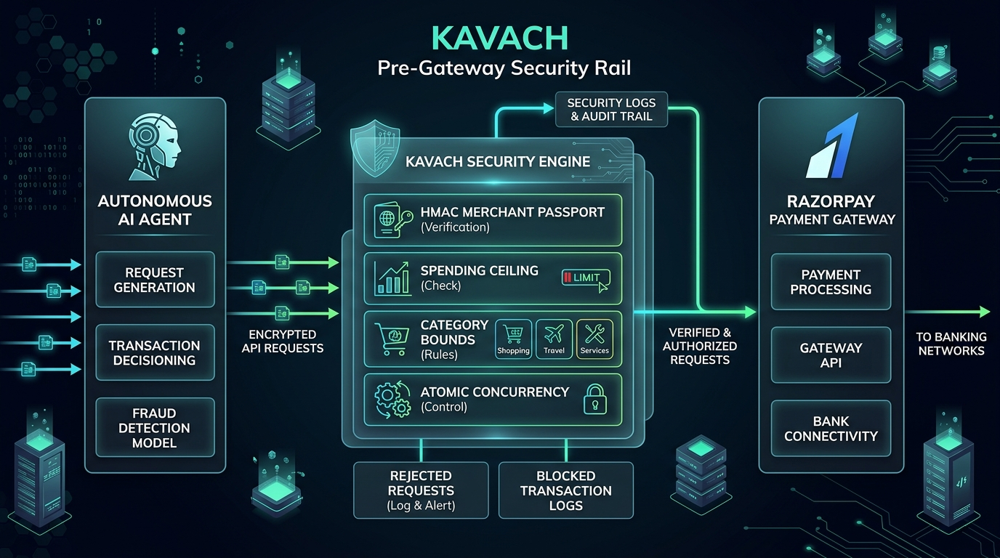
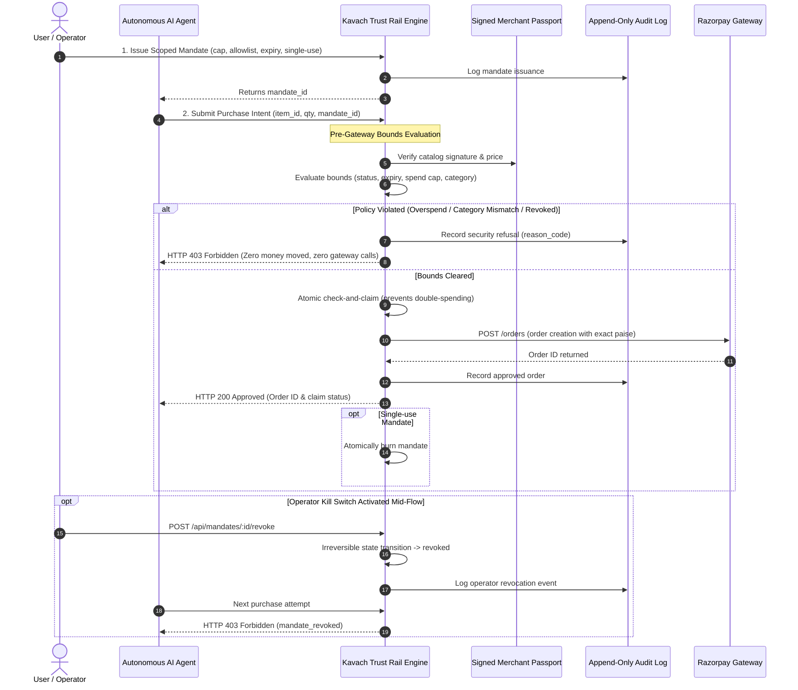
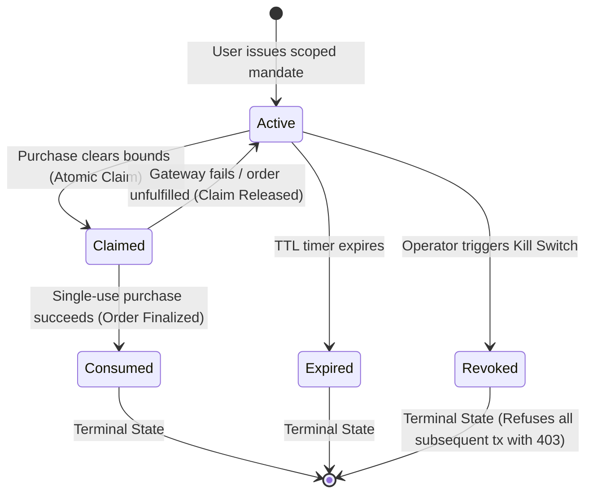

<p align="center">
  
</p>

<div align="center">

# KAVACH (कवच)
### The Pre-Gateway Trust Rail for Autonomous Agentic Commerce
**Razorpay Builderthon • Track 01: Agentic Commerce**

[](https://razorpay.com)
[-10B981?style=for-the-badge&logo=checkmarx&logoColor=white)](tests/)
[](src/passport/)
[](src/mandates/)
[](public/app.js)

<p align="center">
  <a href="#-quickstart--3-minute-demo">Quickstart</a> •
  <a href="#-pre-gateway-architecture">System Architecture</a> •
  <a href="#-core-defensive-pillars">Defensive Pillars</a> •
  <a href="#-the-4-battle-tested-scenarios">Live Demo Personas</a> •
  <a href="#-interactive-presentation-deck">Slide Deck</a> •
  <a href="#-api-reference">API Reference</a> •
  <a href="#-test-suite--formal-invariants">Test Suite</a>
</p>

</div>

---

## 🎯 The Agentic Commerce Dilemma

Autonomous AI agents are increasingly capable of researching products, comparing specs, and negotiating purchases. However, deploying agents into production introduces catastrophic financial liability:

* **Unbounded Spending Loops:** An LLM caught in an execution recursion can drain corporate bank balances or credit lines in minutes.
* **Prompt Injections & Dynamic Price Gouging:** Malicious seller websites or altered metadata can trick buying bots into accepting inflated prices or hostile terms.
* **Binary All-or-Nothing Access:** Legacy payment cards and API keys offer zero granular bounds. Once granted, agents have uninhibited spending capacity.

### The Solution: Kavach Trust Rail
**Kavach (कवच — shield)** is an open, high-performance security rail that sits between autonomous AI agents and the Razorpay payment infrastructure. It enforces cryptographic and deterministic spending policies **before a single rupee moves and before any payment gateway API call is initiated**.

---

## 🏛️ Pre-Gateway Architecture

<p align="center">
  
</p>

### End-to-End Sequence & Decision Flow



---

## 🛡️ Core Defensive Pillars

| Pillar | Technical Mechanism | Protection Guarantee |
|---|---|---|
| **1. Cryptographic Merchant Passport** | HMAC-SHA256 signature calculated over normalized catalog versions, product IDs, stock, prices, and return policies. | Tamper-evident: any altered rupee amount, phantom SKU, or manipulated return policy invalidates the signature instantly. |
| **2. Atomic Mandate Engine** | Hardware-grade spending bounds: amount ceiling in integer paise, category allowlists, expiry timers, and single-use burns. | Pre-gateway isolation: evaluated strictly before gateway calls. Zero leakage, zero wasted Razorpay API quotas. |
| **3. Concurrency Check-and-Claim** | Serialized in-memory write mutex for claims and burns before initiating external HTTP calls. | Race-condition immunity: concurrent parallel agent requests on a single-use mandate can never double-spend. |
| **4. Live Revocation Kill Switch** | Operator-triggered terminal state transition (`active` -> `revoked`) with 409 conflict detection for in-flight requests. | Instant human control: halt compromised or rogue agent loops mid-flight with zero state corruption. |
| **5. Append-Only Audit Rail** | Immutable JSONL event log with synchronous disk flushes and dual machine/human explanation rendering. | Full auditability: complete forensic trail mapping cryptographic reason codes to plain-language records. |

### Mandate Lifecycle State Machine



---

## 🚀 Quickstart & 3-Minute Demo

### 1. Installation and Boot

```bash
# Clone the repository
git clone https://github.com/LakraAnshul/kavach.git
cd kavach

# Install dependencies (zero build step, pure native Node.js)
npm install

# Configure environment keys
cp .env.example .env

# Launch the Kavach trust rail server (runs on http://localhost:3000)
npm start
```

### 2. Live Dashboard & Presentation Deck
* **Live Dashboard:** Open [`http://localhost:3000`](http://localhost:3000) for real-time Passport seals, active Mandate tiles, and the live Audit Rail.
* **Interactive Slide Deck:** Open [`http://localhost:3000/slides.html`](http://localhost:3000/slides.html) (or double click `slides.html`).

---

## 🎭 The 4 Battle-Tested Scenarios

Run the four scripted agent personas in separate terminal windows to witness Kavach's defensive policies live:

```bash
# Terminal 1: Happy Path Buyer
npm run agent:a

# Terminal 2: Overspend Attacker
npm run agent:b

# Terminal 3: Category Mismatch Buyer against Second Merchant
npm run agent:c

# Terminal 4: Mid-Flow Mandate Revocation (Live Kill Switch)
npm run agent:revoke_demo
```

| Scenario | Agent Persona | Target Action | Policy Constraint | Outcome & Verdict |
|---|---|---|---|---|
| **Act 1** | `Agent A` (Happy Path) | Purchases Mechanical Keyboard K1 (₹3,499.00) | ₹5,000.00 ceiling, `electronics`, single-use | **APPROVED (HTTP 200)**: Razorpay order created, single-use mandate burned. |
| **Act 2** | `Agent B` (Overspend Attack) | Attempts buying Mechanical Keyboard (₹3,499.00) | Budget capped at ₹1,000.00 | **BLOCKED (HTTP 403 `mandate_exceeded`)**: Blocked pre-gateway; zero funds moved. |
| **Act 3** | `Agent C` (Category Violation) | Attempts buying Artisan Espresso (₹1,450.00, `beverages`) from 2nd merchant | Scoped strictly to `equipment` | **BLOCKED (HTTP 403 `category_not_allowed`)**: Pre-gateway policy enforcement holds. |
| **Act 4** | `Revoke Demo` (Kill Switch) | Reusable ₹10,000 mandate executes 1st order, then operator hits Revoke | Mid-flow operator revocation | **BLOCKED (HTTP 403 `mandate_revoked`)**: Subsequent purchase attempt instantly rejected. |

---

## 🧪 Test Suite & Formal Invariants

Kavach features 100% automated test coverage across 8 isolated test suites comprising over 120 assertions:

```bash
# Run all eight suites sequentially
npm test
```

```
========================================
PASS  tests/test_passport_tamper.js      (25/25)  HMAC signature & field tampering detection
PASS  tests/test_mandates.js             (6/6)    Mandate bounds (expired, exceeded, category, reuse)
PASS  tests/test_concurrency.js          (6/6)    Engine-level check-and-claim race condition isolation
PASS  tests/test_transaction_race.js     (7/7)    HTTP-level concurrent transactions with live gateway
PASS  tests/test_webhook.js              (7/7)    Razorpay webhook signature verification over raw bytes
PASS  tests/test_catalog_ingestion.js    (42/42)  CSV/JSON parsing, schema validation, 2MB size limits
PASS  tests/test_multi_merchant.js       (23/23)  Independent multi-merchant catalogs and price isolation
PASS  tests/test_mandate_revocation.js   (8/8)    Terminal state transitions and 409 conflict handling
========================================
ALL 8 SUITES PASSED (100% Integrity)
```

Individual test targets:
```bash
npm run test:passport        # Tamper every field -> verification must break each time
npm run test:mandates        # Expired / exceeded / category / reuse / malformed / happy path
npm run test:concurrency     # Engine: a single-use mandate must not clear twice when requests race
npm run test:race            # HTTP: the same race through POST /api/transactions with live gateway
npm run test:webhook         # Signature verification against exact Content-Type Razorpay sends
npm run test:ingestion       # Catalog upload: validation, versioning, file types, size limits, path traversal
npm run test:multimerchant   # Two merchants sharing a product id must price independently
```

---

## 📡 API Reference

| Route | Method | Description | Error Codes |
|---|---|---|---|
| `/api/merchants/:id/catalog` | `POST` | Ingest catalog as new version (JSON body or multipart `.csv`/`.json`, 2MB max, 500 items max). | `400` malformed, `413` oversized |
| `/api/merchants` | `GET` | List all merchants with ingested catalogs, product counts, and active versions. | `200` |
| `/api/merchants/:id/catalog` | `GET` | Retrieve stored catalog (`?version=N` retrieves historical version). | `404` not found |
| `/api/passport/generate` | `POST` | Issue HMAC-SHA256 signed catalog manifest for specified merchant. | `404`, `422`, `500` |
| `/api/passport` | `GET` | Fetch manifest with real-time cryptographic validation seal. | `200` |
| `/api/mandates` | `POST` | Issue scoped mandate (`agent_id`, `max_spend_paise`, `category_allowlist`, `expiry_timestamp`, `single_use`). | `400` malformed |
| `/api/mandates` | `GET` | List issued mandates with computed lifecycle status (`active`, `claimed`, `consumed`, `expired`, `revoked`). | `200` |
| `/api/mandates/:id/revoke` | `POST` | Instant Kill Switch: transitions mandate to terminal `revoked` state. | `404`, `409` conflict |
| `/api/transactions` | `POST` | Pre-gateway bounded execution: claims mandate, prices item from signed catalog, and creates Razorpay order. | `403` policy refusal, `409` conflict |
| `/api/webhooks/razorpay` | `POST` | Cryptographic webhook endpoint verifying `X-Razorpay-Signature`. | `400` bad body, `403` bad sig |
| `/api/audit` | `GET` | Read immutable, append-only JSONL audit trail with plain-language reasons. | `200` |
| `/api/health` | `GET` | Service liveness check and Razorpay key configuration status. | `200` |

---

## 🔒 Deep Technical Guarantees Enforced in Code

1. **Indivisible Check-and-Claim:** Checking and claiming cannot be separate steps because live gateway network roundtrips take ~200ms. A gate that only checks would allow a second concurrent request to read a still-active mandate and authorize a double payment. Kavach uses an atomic in-memory mutex chain holding concurrent attempts to exactly one approval.
2. **Safe Integer Math in Integer Paise:** All monetary calculations use integer paise end-to-end and validate within safe JavaScript integer limits ($< 2^{53}$), avoiding floating-point rounding bugs entirely.
3. **Strict Path-Traversal Allowlisting:** The `merchant_id` parameter is strictly validated against an alphanumeric and hyphen allowlist, preventing path traversal attacks (`../`) before resolving catalog paths.
4. **All-or-Nothing Catalog Ingestion:** Ingested catalogs are fully validated in memory before writing to disk. Any invalid row rejects the upload entirely, leaving previous versions completely intact and active.
5. **Raw Body Middleware Ordering for HMAC Integrity:** Raw body parsers are mounted strictly ahead of Express JSON parsers on webhook endpoints. This preserves exact byte sequences required for genuine HMAC signature verification without stream corruption.
6. **Synchronous Audit Durability:** Transaction decisions are flushed to disk before HTTP responses return to the caller, ensuring no decision is lost in volatile memory if the process terminates.

---

<div align="center">
  <sub>Built with precision for Razorpay Builderthon 2026 • Track 01: Agentic Commerce</sub>
</div>
